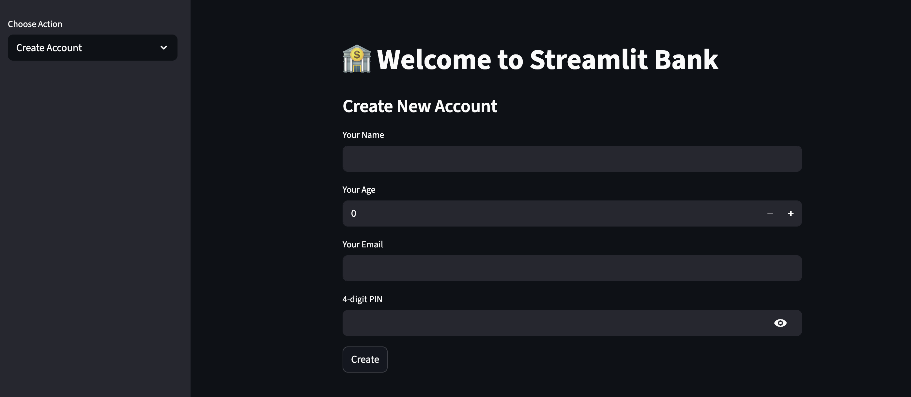
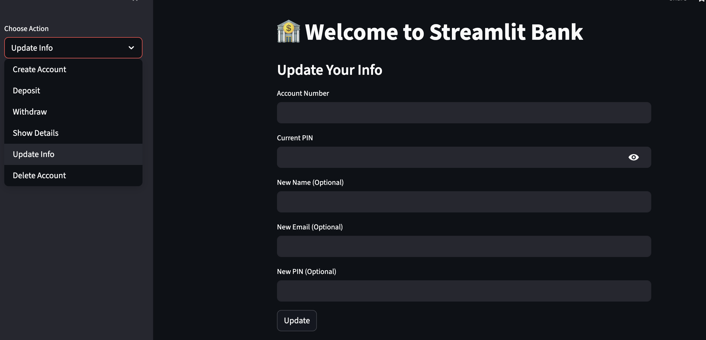
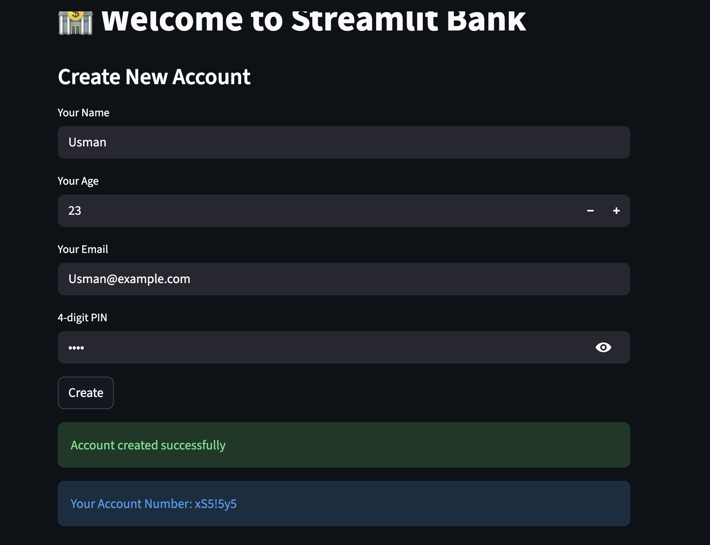

# Bank-Management-System
A Python-based bank management application with both Streamlit web UI and CLI support, featuring account creation, balance operations, and JSON-based data persistence.

## Live Demo:
https://bank-management-system-usman.streamlit.app/

## **Project Overview:**

This project simulates a simple banking system where users can manage accounts through either:
- a **web-based UI** built with Streamlit, or  
- a **terminal-based CLI application**.

It was built to demonstrate:
- clean Python class-based design
- CRUD operations
- validation and business logic
- data persistence
- deployment of a live Python web application

## Features:

### Account Management
- Create a new bank account (with age and PIN validation)
- Automatically generate unique account numbers
- View account details securely using account number and PIN

### Transactions
- Deposit funds with defined limits
- Withdraw funds with balance validation
- Real-time balance updates

### User Management
- Update user information (name, email, PIN)
- Delete accounts securely

### Persistence
- Account data is stored persistently using a local JSON file (`data.json`)

### Multiple Interfaces
- **Web UI:** Interactive Streamlit application
- **CLI:** Terminal-based version for direct interaction

Tech Stack:
- **Language:** Python  
- **Web Framework:** Streamlit  
- **Data Storage:** JSON (file-based persistence)  
- **Architecture:** Class-based backend logic shared across interfaces 

## Screenshots

### Home Screen

### Available Actions

### Successful Operation

## Notes:
The web application is deployed using Streamlit Community Cloud which allows faster interaction

PINs are stored in plaintext for simplicity and educational purposes

In a production environment, PINs would be hashed and stored securely

## Future Improvements:

Replace JSON storage with SQLite or PostgreSQL

Hash PINs for improved security

Add transaction history with timestamps

Add unit tests using pytest

Expose functionality via a REST API (FastAPI)

Dockerize the application
